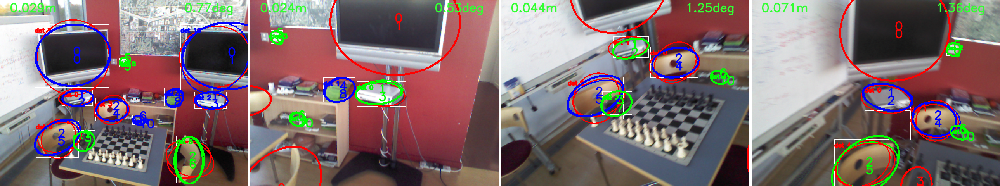

# 3D-Aware Ellipses for Visual Localization

Extended implementation of the paper: *3D-Aware Ellipse Prediction for Object-Based Camera Pose Estimation. Matthieu Zins, Gilles Simon, Marie-Odile Berger*, 3DV 2020. [Paper](https://hal.inria.fr/hal-02975379) | [Video](https://youtu.be/PhE4LzsqjAE)


<p align="center">

</p>


## Installation

The file ```env/environment.yml``` lists the basic dependencies.
Run the following command to create a virtual environment (called *visual-loc*) with these dependencies installed.


```
conda env create -f env/environment.yml
```

### Pyellcv library

The code additionally depends on the [**pyellcv**](https://github.com/zinsmatt/pyellcv) library for ellipses/ellipsoids manipulation and pose computation.

```
python -m pip install 'git+https://github.com/zinsmatt/pyellcv.git'
# (add --user if you don't have permission)

# Or, to install it from a local clone:
git clone --recursive https://github.com/zinsmatt/pyellcv.git
python -m pip install -e ./pyellcv
```

### Object Detection

We use Detectron2 for object detection. It provides implementation and pre-trained weights for state-of-the-art object detection algorithms. In particular, we use the Faster R-CNN architecture.

```
python -m pip install 'git+https://github.com/facebookresearch/detectron2.git'
# (add --user if you don't have permission)

# Or, to install it from a local clone:
git clone https://github.com/facebookresearch/detectron2.git
python -m pip install -e detectron2
```


## Data

To demonstrate the method, we used the [Chess](http://download.microsoft.com/download/2/8/5/28564B23-0828-408F-8631-23B1EFF1DAC8/chess.zip) scene of the [7-Scenes](https://www.microsoft.com/en-us/research/project/rgb-d-dataset-7-scenes/) dataset.
You can easily apply the method on your own dataset. There are only two files required (described below):
- **scene model**
- **dataset file**

### Scene model

The localization method is based on a scene model in the form of an ellipsoid cloud. We adopted a simple JSON format, describing the ellipoids with some semantic information (i.e the object category).

```jsonc
{
    "category_id_to_label": {
        "0": "tv",
        "1": "chair",
        // ...
    },
    "objects": [
        {
            "category_id": 3,
            "object_id": 7,
            "ellipsoid": {
                "axes": [0.1, 0.2, 0.3],
                "R": [], // 3x3 rotation matrix
                "center": [0.2, 0.2, 0.4],
            }
        },
        // ...
    ]
}
```

 We provide a scene model for the Chess scene of the 7-Scene dataset, composed of 11 objects (from 7 cateories) on the Chess scene of the 7-Scenes dataset.
<p align="center">

</p>


### Data preparation

We use a common JSON format for grouping the pose-annotated images of our dataset. We provide a script (`prepare_7-Scenes.py`) for transforming the 7-Scene dataset into this format, but it can be easily adapted for your own dataset.


```jsonc
[
    {
        "file_name": ".../frame-000000.color.png",
        "width": 640,
        "height": 480,
        "K": [], // 3x3 intrinsic matrix
        "R": [], // 3x3 rotation matrix
        "t": [], // 3-vector translation
    },
    // ...
]
```


> **WARNING**: Because of assumptions on the camera roll made in P2E (required when only 2 objects are visible), the z-axis of the scene coordinate system needs to be vertical (and the XY-plane is horizontal). If this is not the case in your dataset but you still want to handle the 2-objects case, you will need to transform the scene coordinate system. This is what we did for the Chess scene (see `prepare_7-Scenes.py`). **Note that this transformation is not needed if you use P3P**.


### Automatic data annotation

Elliptic annotations for objects can be generated from the scene model and the pose-annotated images using `annotate_objects.py`. This adds objects annotations (bounding box, category, projection ellipse) to a dataset file. Our JSON format is actually based on the format used by Detectron2 and can thus be used for training both Faster R-CNN and the ellipse prediction networks.


**The full pre-processing pipeline (preparation + annotation) for generating the training and testing datasets for the Chess scene can be run with:**
```
sh run_preprocessing.sh path/to/chess/scene/folder
```

This will generate 4 files:
- 7-Scenes_Chess_dataset_train.json
- 7-Scenes_Chess_dataset_test.json
- 7-Scenes_Chess_dataset_train_with_obj_annot.json
- 7-Scenes_Chess_dataset_test_with_obj_annot.json


## 3D-Aware ellipse prediction

<p align="center">

</p>


### Pre-trained models
Pre-trained weights for the ellipse prediction part on the Chess scene can be downloaded [here](https://www.dropbox.com/s/ip1lxextt173p03/checkpoints_ellipses_Chess.zip?dl=0).

### Training
To train the ellipse prediction network for each object of the scene, run:

```
python train_ellipse_prediction.py data/7-Scenes_Chess_scene.json 7-Scenes_Chess_dataset_train_with_obj_annot.json 7-Scenes_Chess_dataset_test_with_obj_annot.json ellipses_checkpoints [--nb_epochs 300]
```

### Evaluation
```
python eval_ellipse_prediction.py data/7-Scenes_Chess_scene.json 7-Scenes_Chess_dataset_test_with_obj_annot.json ellipses_checkpoints [--output_images out_folder]
```


## Object detection

### Pre-trained models
Pre-trained weights for the object detection network fine-tuned on objects of *Chess* can be downloaded [here](https://www.dropbox.com/s/fmau4nsp2zbf7fi/checkpoint_detection_Chess.pth?dl=0).

### Training
```
python train_object_detector.py 7-Scenes_Chess_dataset_train_with_obj_annot.json detector_checkpoint/final.pth [--nb_epochs 2000]
```


### Testing
```
python run_object_detector.py 7-Scenes_Chess_dataset_test.json detector_checkpoint/final.pth --visualize [--skip frames 10 --save_detections_file detections.json]
```


### Configurations
The `config.py` file contains parameters that can be changed. Especially, it defines the level and kind of data augmentation used during training.

 ## Running visual localization

> **WARNING**: The code for camera pose estimation using P1E and P2E could not be released publicly. This repository is thus limited to the P3P version, which anyway performs better and can handle almost all the cases. (Compared to the paper, only the 2-object case is not covered.)

In order to run the full visual localization pipeline, you need:
* the test dataset file in JSON format.
* trained weights for the object detection network (Faster R-CNN).
* trained weights for ellipse prediction networks (or `--disable_ellipses_prediction`).

Run the following command:

 ```
 python run.py data/7-Scenes_Chess_scene.json  7-Scenes_Chess_dataset_test.json detector_checkpoint/final.pth ellipses_checkpoints --visualize [--output_images output_folder --skip_frames 50 --output_predictions predictions.json --output_errors errors --disable_ellipses_prediction]
```

> The option `--disable_ellipses_prediction` can be used to disable ellipses prediction. Ellipses directly fitted to bounding boxes will be used instead.


The output images represent the result of the ellipses IoU-based RANSAC.
The objects detected by Faster R-CNN are shown with white boxes. The bold ellipses represent the ellipsoids of the scene model projected with the estimated camera pose. The thin ones correspond to the 3D-aware detections (i.e predicted ellipses).


Color code:
- <span style="color:green">*green*</span> predicted ellipses and projected ellipsoids used inside the pose computation (P3P or P2E).
- <span style="color:blue">*blue*</span> predicted ellipses and projected ellipsoids not directly used inside the pose computation but selected as inliers in the validation step of RANSAC.
- <span style="color:red">*red*</span> predicted ellipses and projected ellipsoids not used for pose computation.

The top-left value is the position error (in meters) and the top-right value is the orientation error (in degrees).

Notice that there might be several ellipses predicted per object, as several objects of the same category can be present in the scene and the detection module can only recognize objects categories (not instances).



